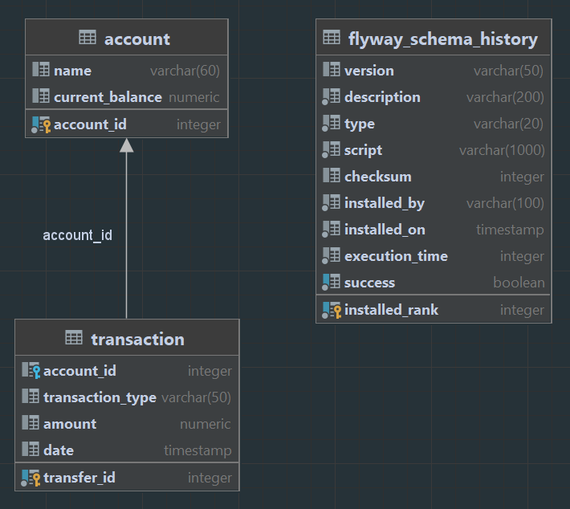
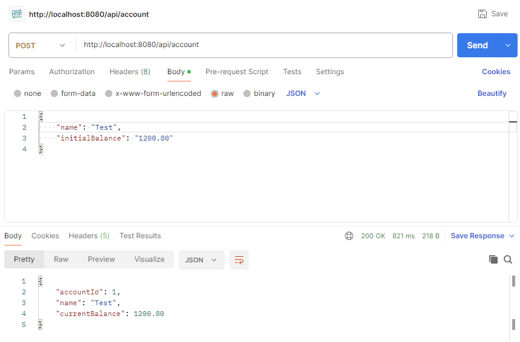
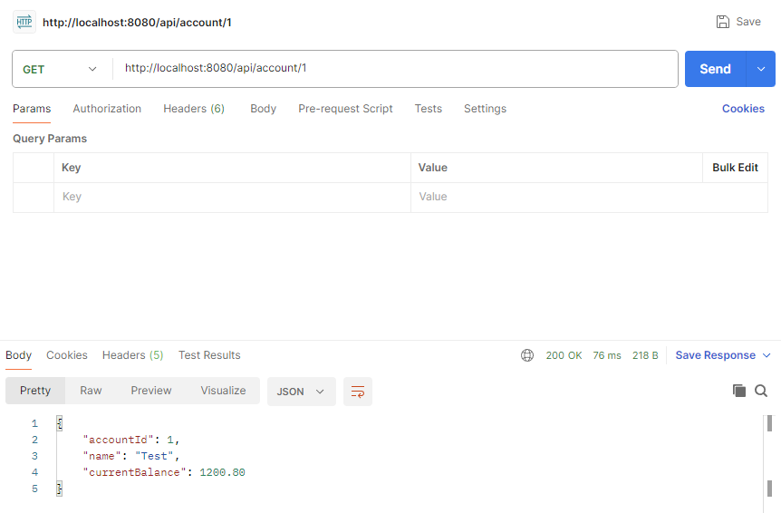
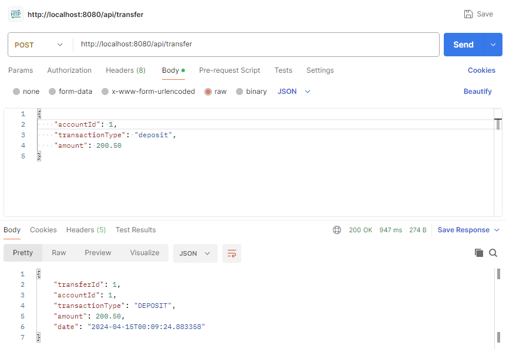
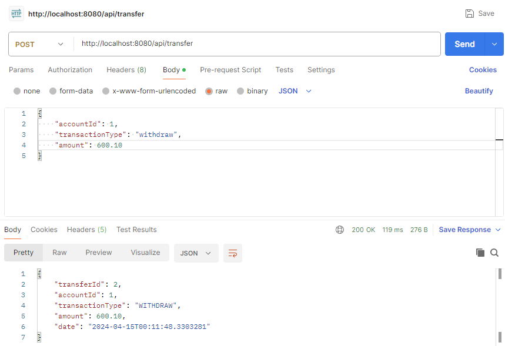
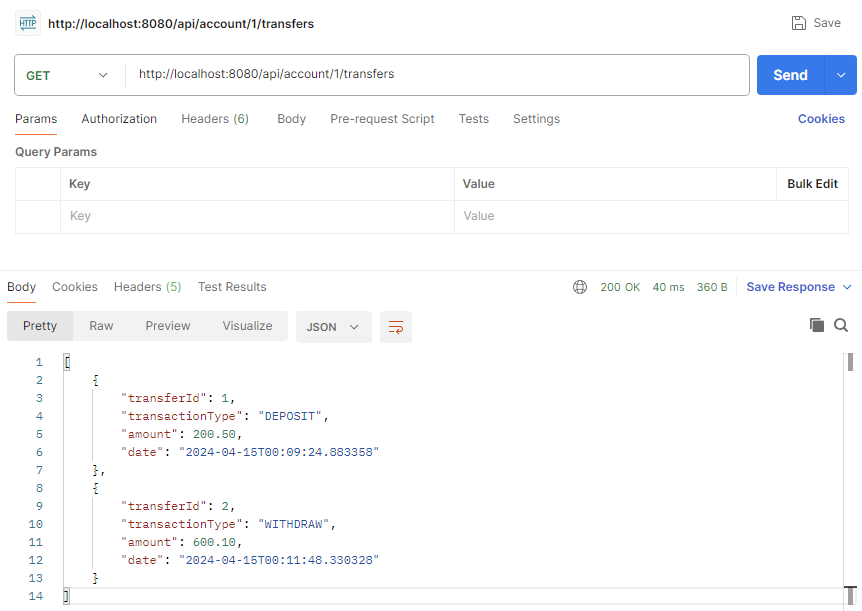
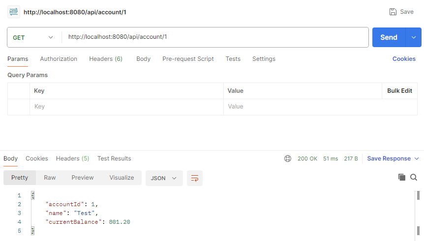

# Money Transfer Service

## Използвани технологии

За реализацията на проекта са използвани следните технологии:

- **Spring Boot**
- **Kotlin**
- **JOOQ**
- **Postgres Database**
- **Flyway**
- **Docker**

## Модел на базата данни

Използвал съм релационна база данни Postgres.
Диаграма на базата можете да видите на снимката отдолу:



## Стартиране на проекта

За да стартирате проекта локално, следвайте следните стъпки:

1. Инсталирайте Java Development Kit (JDK) версия 21.
2. Конфигурирайте Postgres база данни.
- Базата е конфигурирана чрез Docker контейнер. Изпълнил съм следния скрипт в терминала, за да сваля и стартирам контейнера:
```bash
docker pull postgres:16.2

docker run -d --name MoneyTransferDB -e POSTGRES_USER=postgres -e POSTGRES_PASSWORD=123456 -e POSTGRES_DB=money_transfer -p 5432:5432 postgres:16.2
```

- Ако вече имате сетъпната база, която искате да използвате можете да променете настройките за връзка с базата данни в `application.properties` файла.

3. Стартирайте приложението.

## Test evidence

1. Money Account
- Create a new money account



- Get details of a specific account



2. Transfer Record
- Perform a deposit and withdrawal operation





- Fetch all transfers performed on an account



3. After all the deposit and withdrawal operations we can check the Account details again

